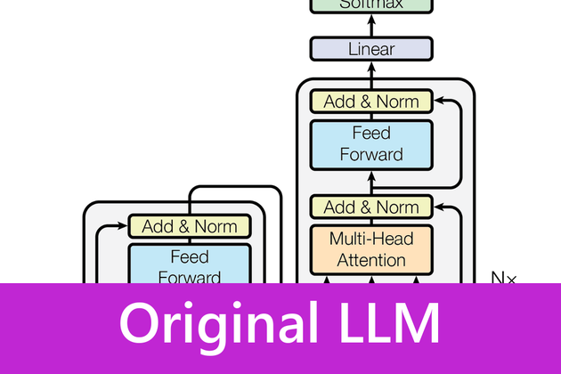

# 🤖💬 Original LLM


<p align="center">
  
</p>

## 📝 Project Description
Welcome to **Original LLM** 🤖💬 !
The goal of this project is to **implement a Transformer model step by step**, inspired by the architecture behind **GPT (Generative Pre-trained Transformer)**.

This repository shows how to go from **a simple Bigram model** ➡️ to **a multi-layer Transformer** capable of generating text in French 🇫🇷 and English 🇬🇧 for example.

This repo is the first of a series 📚

  🧬 [Modern LLM](https://github.com/Thibault-GAREL/LLMs_modern_from_scratch) rebuilds everything the open-weights models changed after 2017 (RoPE, GQA, MoE, RMSNorm), each deviation behind its own config flag so they can be compared one at a time.

  🔁 [llm-harness](https://github.com/Thibault-GAREL/LLM_harness) documents the **harness**, the program wrapped around a trained model. A model like the one here only predicts the next token, it cannot open a file, run a command, or remember what it did. The harness is the loop that hands it tools, feeds the results back as new tokens, and decides what still fits in the context window. **That loop is the entire difference between a text generator and an agent.**

---

## ⚙️ Features

This repository contains two different implementations of language models: a **simple Bigram model** and a **full Transformer model**.

### 🔹 Simple Bigram Model
→ super simple, fast, but no context awareness

- 🏗️ **Architecture**: Basic bigram model using only an embedding table (`token → vocab_size`)
- 🎯 **Prediction**: Each token directly predicts the next one via a lookup table
- 📚 **Dataset**: *Harry Potter* text, character-level encoding
- ⚙️ **Training**: 10,000 steps with AdamW optimizer (`lr=1e-3`)
- ⚠️ **Limitation**: No context (each prediction is independent from the previous ones)
- ✨ **Generation**: Multinomial sampling over softmax probabilities


### 🔹 Transformer Model
→ powerful, context-aware, more expensive to train

- 🏗️ **Architecture**: Transformer with multi-head attention + feed-forward networks
- 🔑 **Self-Attention**: Key-Query-Value mechanism with causal masking
- 🧠 **Multi-Head Attention**: 6 parallel heads (`n_head=6`)
- 📏 **Positional Encoding**: Position embeddings to capture sequential order
- 🧩 **Transformer Blocks**: 6 layers (`n_layer=6`) with residual connections
- 🧽 **Normalization**: LayerNorm before each sub-layer
- 🛡️ **Regularization**: Dropout (`0.2`) to reduce overfitting
- 📏 **Extended Context**: Block size of `256` tokens vs. `8` in bigram
- 📚 **Dataset**: Texts of *Victor Hugo*
- ⚡ **Optimizations**: GPU/CUDA support, periodic train/val loss evaluation
- 🤖 **Generation**: Context-aware text generation

---

## Example Outputs

After just **5,000 iterations**🏋 :

| Description        | Example                                                                                                                                                                                                                                                                                                                                                                                                                                                                                                                                                                                                                                                                                                                                                                                                                                                                                                                                                                                                                                                                                                                                                                                                                                                                                                                                                                                                                                                                                                                                                                                                                                                                                                                                                                                                                                                                                                                                                                                                                                                                                                                                                                                                                                         |
|--------------------|-------------------------------------------------------------------------------------------------------------------------------------------------------------------------------------------------------------------------------------------------------------------------------------------------------------------------------------------------------------------------------------------------------------------------------------------------------------------------------------------------------------------------------------------------------------------------------------------------------------------------------------------------------------------------------------------------------------------------------------------------------------------------------------------------------------------------------------------------------------------------------------------------------------------------------------------------------------------------------------------------------------------------------------------------------------------------------------------------------------------------------------------------------------------------------------------------------------------------------------------------------------------------------------------------------------------------------------------------------------------------------------------------------------------------------------------------------------------------------------------------------------------------------------------------------------------------------------------------------------------------------------------------------------------------------------------------------------------------------------------------------------------------------------------------------------------------------------------------------------------------------------------------------------------------------------------------------------------------------------------------------------------------------------------------------------------------------------------------------------------------------------------------------------------------------------------------------------------------------------------------|
| **Generated Text** | <div style="height: 300px; overflow-y: auto; white-space: pre-wrap;">L'homme a vie Vient pared »<br> Et leurs pas, ébranlant les arches colossales, Troublent les morts couchés sous le pavé des salles.<br> « Oui, nous triomphons ! Venez, sœurs en toutes la foules échoses,<br> D'où fut notre prend notre tout fincens.  Le vent les dérité ! cerf, s'édiffrer leur ma des voix ;<br> Et le parles mourents sourirs le profondée, Mour !<br> Mère du bois ils Dieu la vise ent l'air fait des blancs de mains croisées, Triste, tous entière flots que jour passe ;<br> Il pour leur verra qui son ne ferait cette dans la mière ;<br> Le jour est tête en jour, ils sont là sour ma nombre,<br> Ne velous tra. Qu'on noir mon sangla ! Pierme qu'il nous dans les femmes ?<br> Ils ne s'en vont travailler quinze heures sous dont les tiffles ; Il profond des de l'enfini qui sortes astères,<br> La femme sous luille avec le noir poit.<br> Sans le vers main mauglant, filets attenant ; L'horreur bon est comte le vieille ; L'inge nous pare ; le maître ; leurs mes bleaux ; S'il me vol branche l'amour, regarde, et la nuit.<br> La pauvre montagne homme a Va degrés ! »<br> Le vol plus à cert la porte fix sont qui le partie : La maine se valle, Pour les bouche pritaint en pleint frilleur,<br> Et vous êtes l'homme un flot de l'empire à leur bouille !<br> Qui pourre mon cherveux qui rapportez, dans ce chacun !<br> Par à peine ces deux enfants, couvres Ainsi qu'un pour toute heure ;<br> Parvu qu'il elle, frappe elle lible, Temble, à dérans les coiffres qu'un regarde en tremblant son coeur,<br> Je coupens saint le vert d'enfant mennuit pleur moment.<br> Son bis non sang qu'on chevaiement plus frappé.<br> Car vous êtes pous l'ombre de l'amour même ! Vous êtes l'oasis qu'on le luit mour conde et tout fini.<br> Oui, a regarde et de la petite flamme Son au son aeuil s'aira ces ondeul !<br> Car dans le borouche, âme en pyréche à la mal !<br> Couris à la la penit ses cartant pas, L'ondre effroi de sa démon pable à voix !<br> Si ma triste, S'ai je double qui pleur main et voleur !<br> Il vit, qui fui voulez : Chantez, ples mortes,  Cette foule qui fait ce que mure vous</div> |

**🔍 Preliminary Results:**
With only 5,000 iterations (~4h GPU 💻🔥), the model starts producing French-like words (though not meaningful sentences yet).

---

## ⚙️ How it works
- 📖 Read a text dataset (Victor Hugo or Harry Potter, multilingual)
- 🔢 Create a mapping between **characters ↔ integers**
- 🧩 Build **encoders/decoders** to switch between text and numbers
- ✂️ Split the dataset into **training (90%)** and **validation (10%)**
- 📦 Process text into **blocks** (context windows) and **batches**
- 🏗️ Implement a **Bigram Language Model**
- 🚀 Train the model using **PyTorch** (`AdamW` optimizer)
- ✨ Generate new text sequences and have fun 😆 !!!

---

## 🗺️ Schema

This part walks through the Transformer block by block. The same content, in slide form, is in [`Formation Architecture Transformer - ILab.pdf`](Formation%20Architecture%20Transformer%20-%20ILab.pdf), the deck I wrote to present the architecture.

### **Embedding**:

<p align="center">
  
</p>

Embedding is the keystone of the "understanding" of the words and their senses for transformer models :

Embedding is a way to **transform something** (text with tokens, image, data...) into a **list of numbers that captures their "meaning"**, not its raw form.

This list of numbers is a **vector with many dimensions**.


For example, let's take two dimensions, **dessertness** and **sandwichness** ! For a food, we can give a **percentage** on each one, so a pair of coordinates, and place, for instance, the apple strudel at (sandwichness = 0.6, dessertness = 0.8) because it is clearly a dessert and it is also a bit packaged like a sandwich :

<p align="center">
  
</p>

Two pieces of content that mean roughly the same thing will have vectors close to each other. Two unrelated contents will be far apart.

The different dimensions can be **grammar, syntax, semantics of words**, but it is not chosen by human logic. It is a mix, intertwined, and not one dimension for one sense (like dessertness). The model has **found by itself, learned through training** a geometry, an embedding to understand well human creations (text, image...).
This is why some people say that **"we have stopped understanding AI"**, because the dimensions have a sense only for the model (and too many dimensions for the human brain), and we can't predict an AI's output other than testing it.

If we apply the same transformation vector for **"royalty"**, we can transform **a man into a king**, or **woman into a queen**, and next to it, prince, princess can be found with the transformation vector "child" approximately :
>E(king) - E(man) + E(woman) ≈ E(queen) <br> <sub>E(...) for the embedding</sub>

Here is a diagram that shows the properties of embeddings (addition, subtraction...). It is a geometric effect that the model learns statistically :

<p align="center">
  
</p>

To find this, the model performs **backpropagation of the global error** in the transformer architecture, but also for the embedding !

Here is an example of training :

<p align="center">
  
</p>

### **Positional Encoding**:

<p align="center">
  
</p>

A Transformer treats a sentence as a set of tokens **in parallel**, **not as a sequential sequence**.
The **positional encoder** is here to **inject the order notion** in the token representations.
So the input of LLM is :

>Input<sub>i</sub> = Embedding(token<sub>i</sub>) + PositionalEncoding(i)

(With i the index of the position)
<br><br>
In the original "Attention Is All You Need" paper, positions are encoded with sines and cosines at different frequencies.
Here is the calculation :

>PE(pos, 2i)   = sin(pos / 10000^(2i / d))
PE(pos, 2i+1) = cos(pos / 10000^(2i / d))

With :
- pos : token position (0, 1, 2, …)
- i = dimension index
- d = total dimension of embedding

It is useful, because the functions are :
- **continuous**,
- **bounded** (no numerical explosion),
- **periodic**,
- and they allow us to express a **position shift** as a simple transformation

For the i dimension :
Calculation of the frequency :
>f = 1 / 10000^(2i / d)
  - If **i** is a **low** dimension, f is **high** !
  - If **i** is a **high** dimension, f is **low** !
Then :
  - If **f** is **high**, it is a fast variation and 2 consecutive positions seem **very different**.
  - If **f** is **low**, it is a slow variation and 2 consecutive positions seem **very similar**.

The same **gap of position** will be, for a **high frequency**, **just 1 or 2 tokens** but, for a **low frequency**, an **entire paragraph**.

It means that the **first dimensions** look at **short term** relations and the **last dimensions** at **long term** relations.
Furthermore, the progression is **exponential** and not linear, to **cover a good range** (many dimensions for short term and mid term, and non redundant long term dimensions).

The `10000` of the formula is exactly what sets this range. Here is the full matrix with a **base of 100** :

<p align="center">
  
</p>

And the same one with a **base of 1 000 000** :

<p align="center">
  
</p>

With a **small base**, the frequencies decrease slowly, so almost every dimension keeps oscillating (a lot of short term detail, but the very long range is never really covered).
With a **big base**, they collapse very fast, so only the first dimensions still vary and all the others become nearly constant (the blue stripes), which wastes them.
`10000` is the compromise chosen in the paper.

<br>

<p align="center">
  
</p>

We calculate **sin and cos** to have an angle, to add a direction. If the value increases, is the position before or after?
It allows to have a bijective representation of the angle, a unique point on the unit circle !

Even if there is a **collision** with the same angle, it is absorbed by the **multiple scale** (short, mid and long term).

The position (PE, for Positional Encoding) is then added to the embedding (E, the token's meaning) :
>Input = E + PE

With:
>E(t)=(e<sub>0</sub>,e<sub>1</sub>,…,e<sub>d−1</sub>) ∈ R<sup>d</sup>

> PE(pos)=(p<sub>0</sub>,p<sub>1</sub>,…,p<sub>d−1</sub>) ∈ R<sup>d</sup>
- With:
  - p<sub>0</sub> = sin(θ<sub>0</sub>)
  - p<sub>1</sub> = cos(θ<sub>0</sub>)
  - p<sub>2</sub> = sin(θ<sub>1</sub>)
  - p<sub>3</sub> = cos(θ<sub>1</sub>)
  - ...

>Input = (e<sub>0</sub> + sin(θ<sub>0</sub>), e<sub>1</sub> + cos(θ<sub>0</sub>), e<sub>2</sub> + sin(θ<sub>1</sub>), e<sub>3</sub> + cos(θ<sub>1</sub>)...)

With this method, the **position pollutes, is mixed with embedding**, but the transformer learns with it !

We can visualize like this :

<p align="center">
  
</p>

With this illustration, we can see the clear difference between the first token and the last one. To understand why the first token is so important, you can watch this video about [Attention Sink](https://www.youtube.com/watch?v=Y8Tj9kq4iWY).

Nowadays, we use Rotary Positional Embedding (RoPE) : it applies a rotation to the Query and Key vectors.

<p align="center">
  
</p>

ALiBi is also used: it adds a distance-based linear bias to attention scores.
It enables better extrapolation to longer sequences.

### **Multi-Head Attention**:

<p align="center">
  
</p>

In a Transformer, the core mechanism is **attention**.
The attention mechanism is built around three vectors derived from the input: Q (Query), K (Key), and V (Value).
They control how each token (word, sub-word, etc.) focuses on others in the same sequence.

Here you can find the schema of a Transformer Model :
(Follow the red numbers to better understand where each schema fits !)

<p align="center">
  
</p>

Here is a cool schema I found ! It is a really clear explanation of the different dimensions for one head:

<p align="center">
  
</p>

#### What Do They Mean ?
Q = Query → What am I looking for?
The question a token asks to find relevant context.

K = Key → What do I contain?
A label that represents what kind of information a token holds.

V = Value → What do I offer?
The actual information content that can be shared if attended to.

#### Another explanation can be :
- Q asks a question: “Who in the sequence can help me?” (For example, Are there any adjectives around me?)

- K provides an identity: “I can help if you need context about X.” (For example, Yes, I'm an adjective !)

- V provides content: “Here’s what I can contribute.” (I can say that one thing in the sentence is blue)


For each product (Q × K for the step 2, and A × V for the step 3) :

<p align="center">
  
</p>

We apply a softmax to get A (we turn the scores of the matrix multiplication, QK<sup>T</sup>/sqrt(d<sub>k</sub>), into probabilities).

<p align="center">
  
</p>

### **Feed Forward**:

<p align="center">
  
</p>

In a Transformer, the feed-forward network (FFN) acts as a standard fully-connected neural network applied independently to each token.
* **Evolution of Activations:** Early Transformers relied on standard **ReLU**, which was later replaced by smoother alternatives like **GELU**, and now predominantly **SiLU/Swish** in modern models.
* **Architecture Shift:** While classic architectures used a simple **2-layer** setup (up-projection → activation → down-projection), modern Large Language Models (like Llama or Mistral) implement a **gated variant (SwiGLU)**. This modern approach uses **3 linear layers** to create a dynamic gating mechanism.

Ultimately, while the attention mechanism allows tokens to communicate, the FFN transforms representations individually, acting as a "key-value memory" that stores the model's factual knowledge.

Nowadays, we use a 3-Layer SwiGLU and no longer the classic 2-Layer FFN ReLU, to have better stability and results :

<p align="center">
  
</p>

### **Add & Norm**:

<p align="center">
  
</p>

Then Add & Norm is here so as not to "forget" the initial prompt:
- Add : We add the embedding found after the multi-head attention and the initial input
- Norm : Then, we normalize the layer. It centers and resizes the values to stabilize and accelerate convergence.

The normalization used in every Transformer is **LayerNorm**, not BatchNorm. In both cases the operation is the same: **center the data to mean = 0 and rescale it to std = 1**, like a standard normal distribution N(0, 1) 📊. The only difference is **which axis you average over**:
- **BatchNorm** → `axis=0` → mean of **each dimension** (across the batch). Each feature is centered to 0 and rescaled to std=1 across all tokens of the batch → depends on the batch size and on the other tokens
- **LayerNorm** → `axis=1` → mean of the **point itself** (across its features). Each token is centered to 0 and rescaled to std=1 independently → fully independent of the batch (even works at inference with `batch_size=1`)

For one token x = (x<sub>1</sub>, x<sub>2</sub>, …, x<sub>d</sub>) of embedding dimension d :
>μ = mean(x<sub>1</sub>, …, x<sub>d</sub>) <br>
>σ² = var(x<sub>1</sub>, …, x<sub>d</sub>) <br>
>y<sub>i</sub> = γ<sub>i</sub> × (x<sub>i</sub> − μ) / sqrt(σ² + ε) + β<sub>i</sub>

Where **γ** (gain) and **β** (bias) are **learnable parameters** that let the network re-stretch or shift the normalized values when needed.

**Geometric intuition**: LayerNorm projects each token onto a sphere of radius √d :
1. Subtracting μ centers the token on the hyperplane x<sub>1</sub> + x<sub>2</sub> + … + x<sub>d</sub> = 0, which is the plane **perpendicular to the vector (1, 1, …, 1)**
2. Dividing by σ forces the token's norm to be √d

Here is a 3D visualization (d = 3, so the sphere of radius √3 intersected with the plane x+y+z=0 becomes a **circle**) :

<p align="center">
  
</p>

The **green point** shows the same token before and after LayerNorm. Its position is completely re-mapped, but its **direction is preserved**.

**Doesn't this destroy the token's identity?** Not really :
- 🎯 The semantic content of a token is encoded in its **direction**, not its norm. Attention computes Q · K<sup>T</sup>, which is essentially a cosine similarity → it only "sees" directions.
- 📐 LayerNorm always removes exactly **2 degrees of freedom** (the mean + the scale). In 3D this is brutal (3 → 1, a circle). But in 512D (BERT) it leaves 510D, so **99.6 %** of the directional information is preserved.
- 🎚️ The learnable **γ** and **β** can re-stretch and shift each dimension after normalization, giving the network all the elasticity it needs.

### 🧾 Brief summary

> So, for me :
>
> The **Multi-Head Attention** part is used to build the right attention links between the tokens. It adds for instance the meaning of "green" to "apple", then "eat", so we end up with the fruit and not the company.
>
> The **FFN** then takes this new representation (food) and adds the knowledge it learned during the training, written into the representation as a "delta" that shifts the meaning.
>
> **Add & Norm** is here to regulate, and to not forget the first representation of the previous tokens.
>
> Once the embedding is rich in information, at the very end of the stack, we do a similarity score between the last embedding and the vocabulary to get the logits, then a softmax on them (with the temperature and so on).
>
> So the full architecture is trained to take previous tokens, determine the links between every token, scratch and deform the representation, to arrive at the next token's embedding.

---


## 📂 Repository structure
```bash
├── img/                                          # Every figure, gif and svg of the README.md
│   ├── _gen_ffn.py                               # Script that generates the FFN comparison svg
│
├── text/                                         # Training corpora (Victor Hugo, Harry Potter, …)
│
├── visualisation/                                # Standalone scripts behind the README figures
│   ├── layernorm_3d.py                           # 3D view of LayerNorm (sphere ∩ plane = circle)
│   ├── positional_encoding.py                    # Positional encoding matrix and its frequencies
│   ├── positional_encoding_widget.ipynb          # Interactive notebook version (sliders)
│
├── Bigram.py                                     # Bigram model + first experiments
├── Transformer.py                                # Full Transformer implementation
│
├── Formation Architecture Transformer - ILab.pdf # My slides about the Transformer architecture
├── LICENSE
├── README.md
```

---
## 💻 Run it on Your PC
Clone the repository and install dependencies:
```bash
git clone https://github.com/Thibault-GAREL/Language_Models.git
cd Language_Models

python -m venv .venv # if you don't have a virtual environment
source .venv/bin/activate   # Linux / macOS
.venv\Scripts\activate      # Windows

# Install PyTorch (CPU only)
pip install torch

# For GPU acceleration (CUDA 12.1), use instead:
pip install torch --index-url https://download.pytorch.org/whl/cu121
```

Next, you can use Bigram Model :
```bash
python Bigram.py
```

Or use Transformer Model :
```bash
python Transformer.py
```

### 📊 Reproduce the figures

The scripts of `visualisation/` redraw the figures used in this README. They only need `numpy` and `matplotlib` :
```bash
pip install numpy matplotlib

python visualisation/positional_encoding.py  # Positional encoding matrix and frequencies
python visualisation/layernorm_3d.py         # 3D visualization of LayerNorm
```

---

## 📖 Inspiration / Sources
This project is based on:
- 🎥 The structure for architecture [Andrej Karpathy – Let's build GPT from scratch](https://www.youtube.com/watch?v=kCc8FmEb1nY)
- 📄 The scientific paper ["Attention is All You Need"](https://en.wikipedia.org/wiki/Attention_Is_All_You_Need)
- 🧠 OpenAI’s GPT-2 / GPT-3 and [nanoGPT](https://github.com/karpathy/nanoGPT)
- 🔄 Explanation video for the Normalization Layer [The Most Underrated Layer Inside Every AI Model](https://youtu.be/JHl_gwVoh-k?is=CrqPJxeXfR-BF9Cz)

For the illustration:
- The training gif for embedding : [Gif site](https://www.reddit.com/r/learnmachinelearning/comments/154s2o5/how_i_created_an_animation_of_the_embeddings/?tl=fr)
- 📄 The scientific paper ["Attention is All You Need"](https://en.wikipedia.org/wiki/Attention_Is_All_You_Need)
- A video from 3Blue1Brown : [Attention in transformers](https://www.youtube.com/watch?v=eMlx5fFNoYc)
- A video from bycloud : [Attention Sink: The Fluke That Made LLMs Actually Usable](https://www.youtube.com/watch?v=Y8Tj9kq4iWY)

Related work of mine: [Modern LLM](https://github.com/Thibault-GAREL/LLMs_modern_from_scratch) for everything the architecture gained after 2017, and [llm-harness](https://github.com/Thibault-GAREL/LLM_harness) for the agent loop that runs a trained model once it exists.

Code created by me 😎, Thibault GAREL - [Github](https://github.com/Thibault-GAREL)
